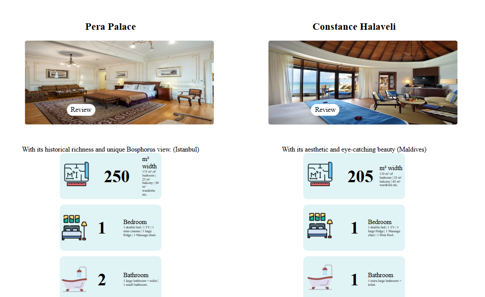
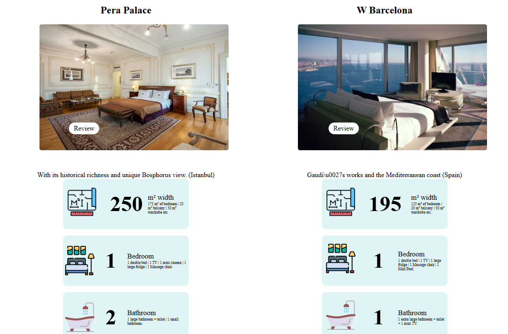

## **HotelPage** 🚀
Bu proje en uygun Hotel fiyatlarını gösteren bir Next.js projesidir.
## **Özellikler** ✨

-   Özellik 1: Hotel verileri güncel bir şekilde gelmektedir.
-   Özellik 2: Hızlı ve güvenli bir altyapıya sahiptir.
-   Özellik 3: Front-End yapısı ağırlıklı bir web sitesidir.
-   Özellik 4: Resimler doğrulanmıştır.
-   Özellik 5: Hotel verileri, örnek amaçlı hayali verilere dayanmaktadır.
## **Kurulum** ⚙️

Projeyi yerel makinenize kurmak için aşağıdaki adımları takip edin:
-   **Depoyu klonlayın:**
     `git clone https://github.com/durmaztayfun22/Hotelpage.git` 
    
-   **Gerekli bağımlılıkları yükleyin:**
    `npm install` 
    
-   **Projenizi başlatın:**
    `npm start`
   ## **Kullanım** 📚

Bu proje, kullanıcıların otel odaları hakkında bilgi alabileceği, odalarını seçebileceği ve rezervasyon yapabileceği bir otel web sitesi sunar. Front-end kısmı, kullanıcı etkileşimlerini yönetmek ve veriyi dinamik olarak sunmak için modern web teknolojileriyle tasarlanmıştır. İşte bu sürecin nasıl çalıştığına dair detaylı bir açıklama:

### **Adım 1: Projeyi Başlatın**

Sunucuyu yerel makinenizde başlatmak için aşağıdaki komutları kullanabilirsiniz:
-   **Depoyu klonlayın:**
     `git https://github.com/durmaztayfun22/Hotelpage.git` 
    
-   **Gerekli bağımlılıkları yükleyin:**
    `npm install` 
    
-   **Projenizi başlatın:**
    `bpm start`
  ### **Adım 2: Web Sitesini Görüntüleyin**

Dilediğiniz Hotel rezervasyonlarında bulabilir, arayabilir ve seçebilirsiniz. Örnek bir resim:

		

